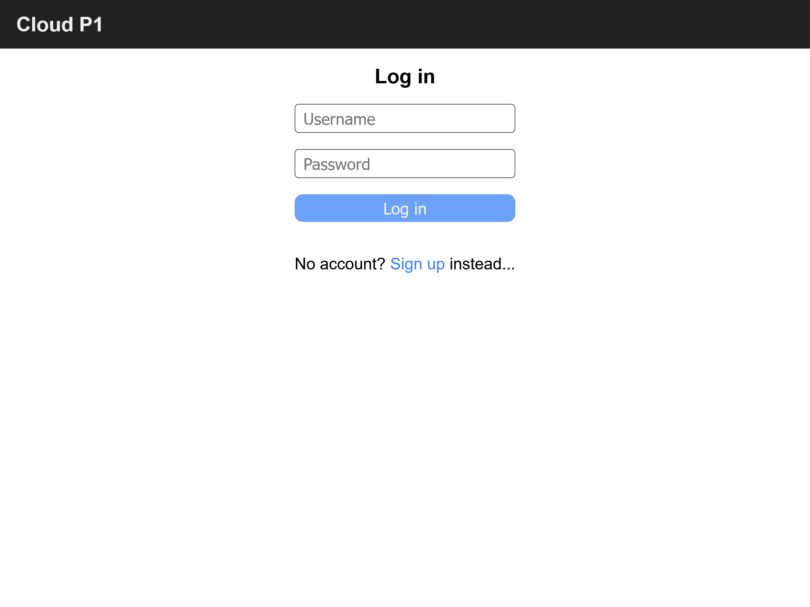

# Cloud Project ☁️ (Application of Cloud Solutions in Web Applications)

<strong>Cloud Project</strong> is a cloud-based demo web chat application built as part of the Application of Cloud Solutions in Web Applications course at the Wrocław University of Science and Technology. It showcases the integration of various AWS products to create a functional and scalable web application. Used AWS services include: EC2, ECS, VPC, RDS, SQS, SNS, Cognito, Lambda, Elasticache, and CloudWatch. The application allows for sign-up, sign-in, and real-time messaging between users (using WebSockets).

## AWS Services 📦

- **EC2**/**ECS**: hosting the application,
- **VPC**: network isolation and security groups,
- **RDS**: database for storing messages,
- **SQS**: communication between services and Lambda,
- **SNS**: notifications coming from CloudWatch,
- **Cognito**: user authentication,
- **Lambda**: asynchronous message processing,
- **Elasticache**: hosting Redis for pub/sub notifications,
- **CloudWatch**: alerts on queue overload.
